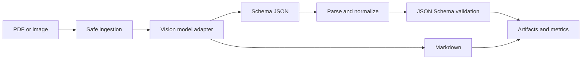

# TriScan

TriScan is an end-to-end multilingual document-understanding starter for English,
Vietnamese and Korean documents. It accepts images or PDFs and produces either
layout-aware Markdown or JSON constrained by a JSON Schema. Every run preserves
the raw model response, normalized result, validation issues and reproducibility
metadata.

The repository is runnable without a GPU in `mock` mode. Real inference can use a
local Transformers model or any multimodal OpenAI-compatible server such as vLLM.

## What is included

- PDF/image ingestion with signature checks, file/page limits, EXIF correction and resizing.
- Multi-page prompt construction with document prompt-injection isolation rules.
- Built-in Invoice, Receipt and Form schemas using JSON Schema Draft 2020-12.
- Deterministic JSON recovery, schema-guided normalization and validation.
- Financial consistency warnings for totals and line items.
- Provider adapters: mock, OpenAI-compatible HTTP and local Transformers.
- CLI, FastAPI, interactive three-panel browser workspace and batch API.
- JSON, Markdown, CSV and XLSX artifacts with per-run metadata.
- CER/WER and structured JSON evaluation with language/document breakdowns.
- VLM LoRA/QLoRA data preparation and TRL training scripts.
- Unit tests, Docker configuration and Windows/macOS/Linux development scripts.

## Architecture



## Quick start

Prerequisites: Python 3.11+ and [uv](https://docs.astral.sh/uv/).

```bash
cp .env.example .env
uv sync --extra dev
uv run triscan serve
```

On Windows PowerShell:

```powershell
Copy-Item .env.example .env
uv sync --extra dev
uv run triscan serve
```

Open <http://127.0.0.1:8080>. The default mock provider proves the complete
pipeline and UI without downloading a model, but it does **not** read document text.

Run the tests:

```bash
uv run pytest
uv run ruff check .
```

## CLI

```bash
# Schema-guided JSON
uv run triscan extract samples/invoice.pdf --type invoice --language vi

# Markdown
uv run triscan extract samples/form.png --mode markdown --language ko

# Custom schema
uv run triscan extract samples/document.pdf --schema-path schemas/my.schema.json

# Directory batch
uv run triscan batch samples --pattern "*.pdf" --type receipt

# Evaluate predictions described by a JSONL manifest
uv run triscan evaluate data/examples/manifest.example.jsonl --output metrics.json
```

Artifacts are written to `runs/<run-id>/`:

```text
source.pdf
raw.txt
result.json
result.csv
result.xlsx
validation.json
metadata.json
```

## Use an OpenAI-compatible multimodal server

TriScan sends OpenAI Vision-style `image_url` content blocks. For example, serve
Qwen3-VL with a compatible vLLM installation:

```bash
vllm serve Qwen/Qwen3-VL-2B-Instruct \
  --host 0.0.0.0 \
  --port 8000 \
  --api-key EMPTY \
  --limit-mm-per-prompt.image 20
```

Then edit `.env`:

```dotenv
TRISCAN_MODEL_PROVIDER=openai_compatible
TRISCAN_MODEL_NAME=Qwen/Qwen3-VL-2B-Instruct
TRISCAN_API_BASE_URL=http://localhost:8000/v1
TRISCAN_API_KEY=EMPTY
```

The same adapter can be used with other servers that implement multimodal Chat
Completions. Make sure the served model has a compatible multimodal chat template.

## Run Qwen3-VL directly with Transformers

```bash
uv sync --extra dev --extra local
```

```dotenv
TRISCAN_MODEL_PROVIDER=transformers
TRISCAN_MODEL_NAME=Qwen/Qwen3-VL-2B-Instruct
```

The first start downloads model weights. GPU/VRAM requirements depend on the model,
precision and number/resolution of pages. Start with one-page documents and the 2B
model before increasing limits.

## API

Interactive OpenAPI documentation is at `/docs`.

| Endpoint | Purpose |
| --- | --- |
| `GET /api/health` | Provider and service health |
| `GET /api/schemas` | List schemas |
| `GET /api/schemas/{name}` | Read a schema |
| `POST /api/extract` | Synchronous single-document extraction |
| `POST /api/batch` | Process multiple files and download a ZIP |
| `GET /api/runs/{run_id}/artifacts/{name}` | Download a generated artifact |

Example:

```bash
curl -F "file=@samples/invoice.pdf" \
  -F "mode=json" \
  -F "document_type=invoice" \
  -F "language=vi" \
  http://127.0.0.1:8080/api/extract
```

## Dataset and evaluation contract

Use one JSON object per line. Paths are relative to the manifest:

```json
{
  "document_id": "invoice-vi-001",
  "source_path": "samples/invoice-vi-001.pdf",
  "ground_truth_path": "labels/invoice-vi-001.json",
  "prediction_path": "predictions/invoice-vi-001.json",
  "mode": "json",
  "language": "vi",
  "document_type": "invoice",
  "split": "validation",
  "source_family": "vendor-template-a",
  "license": "permitted"
}
```

Read `data/ANNOTATION_GUIDE.md` before labeling. Split by template/vendor/source
family to avoid leakage; do not randomly split pages from related documents.

## Fine-tuning

See `training/README.md`. The scripts prepare a conversational vision dataset with
an `images` list plus prompt/completion messages, then use TRL `SFTTrainer` and PEFT
LoRA/QLoRA. Always run a small overfit test before committing to a full experiment.

## Production boundaries

This repository is a strong research/demo foundation, not a turnkey public SaaS.
Before exposing it to the internet, add authentication, tenant isolation, a job
queue, object storage, request quotas, malware scanning, audit logs, retention and
deletion policies, secret management, TLS and monitoring. The bundled synchronous
API intentionally favors traceability and local development over high throughput.

Uploaded source documents are copied into `runs/`. Documents may contain personal
or confidential data; configure retention and remove runs when they are no longer
needed.

## Technical references

- [Transformers multimodal chat templates](https://huggingface.co/docs/transformers/chat_templating_multimodal)
- [Qwen3-VL-2B-Instruct model card](https://huggingface.co/Qwen/Qwen3-VL-2B-Instruct)
- [TRL vision-language SFT](https://huggingface.co/docs/trl/sft_trainer)
- [TRL vision dataset format](https://huggingface.co/docs/trl/dataset_formats#vision-datasets)
- [vLLM OpenAI-compatible server](https://docs.vllm.ai/en/stable/serving/openai_compatible_server.html)
- [JSON Schema validation](https://python-jsonschema.readthedocs.io/en/latest/validate/)
- [FastAPI file uploads](https://fastapi.tiangolo.com/tutorial/request-files/)
- [pypdfium2 Python API](https://pypdfium2.readthedocs.io/en/stable/python_api.html)

